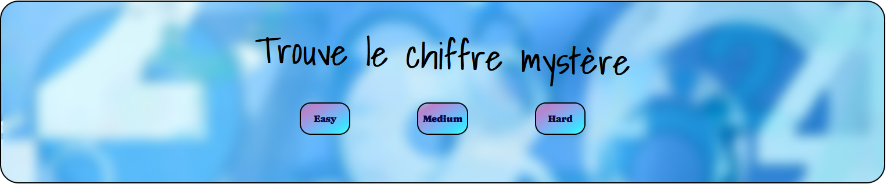
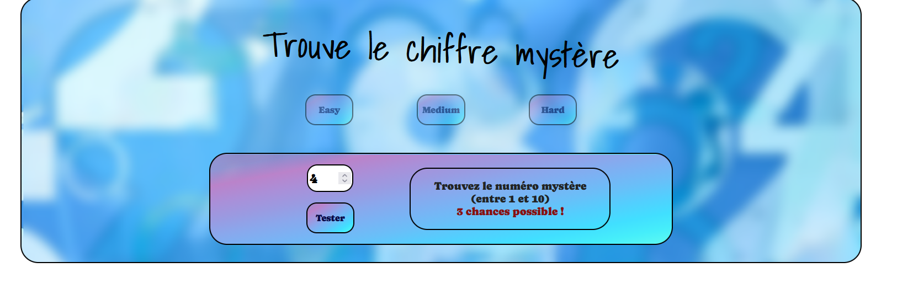
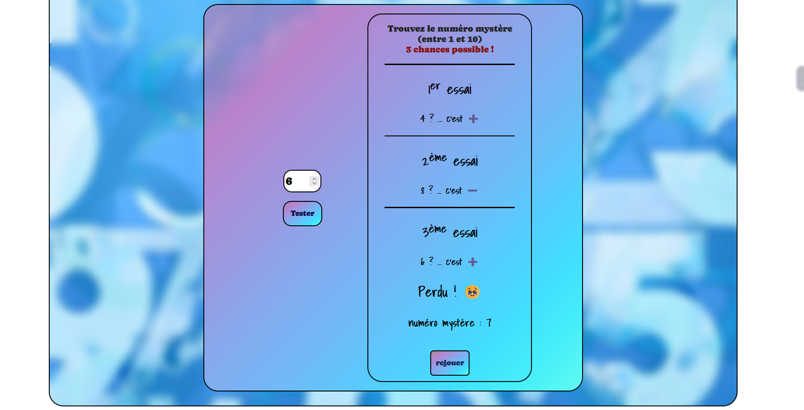
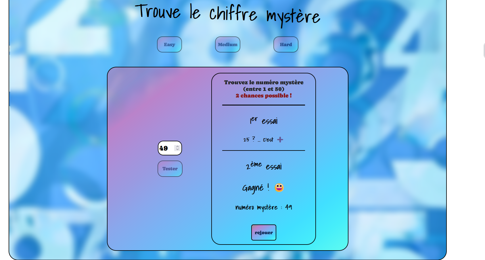

<h1 align="center"># Mystery-number</h1>

## Contexte du projet 

 ###Création du jeu le chiffre mystère

 
  
  
  
  
  

   
## Mon objectif: 

<ul>
<li>Création du chiffre mystère</li>
<li>Plusieurs niveau de diffilcuté</li>

</ul>

### Resources utlisées: 

<ul>
<li>GoogleFonts pour les polices</li>
<li>Github</li>

</ul>

### Langages Utilisés

* [![HTML5][html.com]][html-url]
* [![CSS3][css.com]][css-url]
* [![JS][js.com]][js-url]

[html.com]: https://img.shields.io/badge/html5-%23E34F26.svg?style=for-the-badge&logo=html5&logoColor=white
[html-url]: https://html.com/
[css.com]: https://img.shields.io/badge/css3-%231572B6.svg?style=for-the-badge&logo=css3&logoColor=white
[css-url]: https://www.w3.org/Style/CSS/
[react.com]: https://img.shields.io/badge/React-20232A?style=for-the-badge&logo=react&logoColor=61DAFB
[react-url]: https://fr.reactjs.org/
[js.com]: https://img.shields.io/badge/JavaScript-323330?style=for-the-badge&logo=javascript&logoColor=F7DF1E
[js-url]: https://developer.mozilla.org/fr/docs/Web/JavaScript
[sass.com]: https://img.shields.io/badge/SASS-hotpink.svg?style=for-the-badge&logo=SASS&logoColor=white
[sass-url]: https://sass-lang.com/
